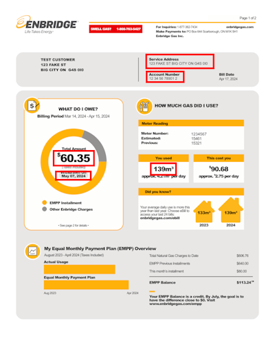

# Bill Data Extract

[](https://www.npmjs.com/package/@cityssm/bill-data-extract)
[](https://app.deepsource.com/gh/cityssm/bill-data-extract/)

Extract data from scanned bill documents into usable details.

## Supported Bills

- [Enbridge Gas](https://www.enbridgegas.com/)
- [PUC Services Inc. (Sault Ste. Marie)](https://ssmpuc.com/)
- 🚧 Other utility bills using [SectorFlow](https://sectorflow.ai/)'s AI platform.

## Installation

```sh
npm install @cityssm/bill-data-extract
```

## Usage

```javascript
import { extractEnbridgeBillData } from '@cityssm/bill-data-extract/enbridge.js'

const billData = await extractEnbridgeBillData('path/to/enbridgeBill.pdf')

console.log(billData)

/*
  {
    accountNumber: '123456789012',
    serviceAddress: '123 FAKE ST BIG CITY ON G4S 0I0',
    dueDate: 'May 04, 2024',
    gasUsage: 139,
    gasUsageUnit: 'm3',
    totalAmountDue: 60.35
  } 
*/
```

## How Does It Work?



The extractor takes a bill as input, either as an image or as a PDF.
"Zones" are identified within the bill to identify where the key details are.
Using [tesseract.js](http://tesseract.projectnaptha.com/) on those zones,
data is extracted and returned as a Javascript object.

💡 Note that while scanned copies of bills are oftentimes supported,
the best source is a bill downloaded directly from the utility company.
